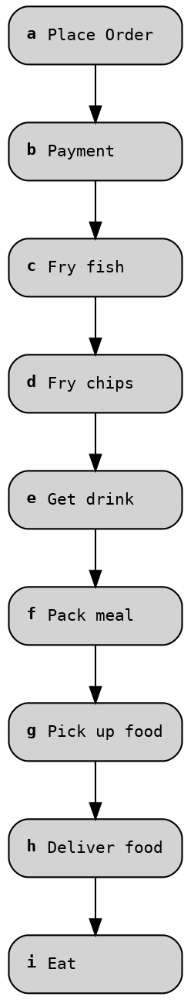

# Workflow Example

Imagine I'm your friend, and you ask me to get takeout for dinner.

Let's consider the workflow of ordering takeout.

```dot process Takeaway Sequential Process
digraph {
    node [
        fontname  = "Monospace"
        fontsize  = 10
        fixedsize = shape
        width     = 1.5
        shape     = rectangle
        style     = "rounded, filled"
    ]

    a [
        label = <
            <table border="0" cellborder="0" cellspacing="0">
            <tr>
                <td align="center" width="15"><b>a</b></td>
                <td align="left" balign="left" width="80">Place Order</td>
            </tr>
            </table>
        >]
    b [
        label = <
            <table border="0" cellborder="0" cellspacing="0">
            <tr>
                <td align="center" width="15"><b>b</b></td>
                <td align="left" balign="left" width="80">Payment</td>
            </tr>
            </table>
        >]
    c [
        label = <
            <table border="0" cellborder="0" cellspacing="0">
            <tr>
                <td align="center" width="15"><b>c</b></td>
                <td align="left" balign="left" width="80">Fry fish</td>
            </tr>
            </table>
        >]
    d [
        label = <
            <table border="0" cellborder="0" cellspacing="0">
            <tr>
                <td align="center" width="15"><b>d</b></td>
                <td align="left" balign="left" width="80">Fry chips</td>
            </tr>
            </table>
        >]
    e [
        label = <
            <table border="0" cellborder="0" cellspacing="0">
            <tr>
                <td align="center" width="15"><b>e</b></td>
                <td align="left" balign="left" width="80">Get drink</td>
            </tr>
            </table>
        >]
    f [
        label = <
            <table border="0" cellborder="0" cellspacing="0">
            <tr>
                <td align="center" width="15"><b>f</b></td>
                <td align="left" balign="left" width="80">Pack meal</td>
            </tr>
            </table>
        >]
    g [
        label = <
            <table border="0" cellborder="0" cellspacing="0">
            <tr>
                <td align="center" width="15"><b>g</b></td>
                <td align="left" balign="left" width="80">Pick up food</td>
            </tr>
            </table>
        >]
    h [
        label = <
            <table border="0" cellborder="0" cellspacing="0">
            <tr>
                <td align="center" width="15"><b>h</b></td>
                <td align="left" balign="left" width="80">Deliver food</td>
            </tr>
            </table>
        >]
    i [
        label = <
            <table border="0" cellborder="0" cellspacing="0">
            <tr>
                <td align="center" width="15"><b>i</b></td>
                <td align="left" balign="left" width="80">Eat</td>
            </tr>
            </table>
        >]

    a -> b -> c -> d -> e -> f -> g -> h -> i
}
```
