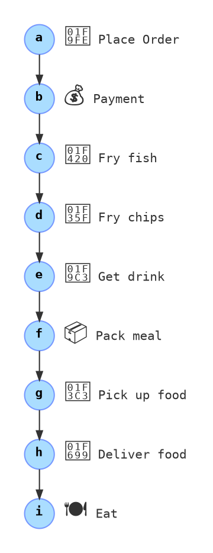

# Workflow Scenario

Imagine I'm your friend, and you ask me to get takeout for dinner.

The following steps represents this workflow:

```dot process Takeaway Sequential Process
digraph {
    graph [
        penwidth  = 0
        nodesep   = 0.1
        ranksep   = 0.3
        bgcolor   = "transparent"
        fontcolor = "#333333"
    ]
    node [
        fontcolor = "#333333"
        fontname  = "Monospace"
        fontsize  = 10
        shape     = "plain"
        width     = 0.04
        margin    = 0.04
        color     = "#7799ff"
        fillcolor = "#aaddff"
    ]
    edge [
        arrowsize = 0.7
        color     = "#333333"
        fontcolor = "#333333"
    ]

    subgraph cluster_a {
        a_text [style = "plain", label = <<font point-size="18">🧾</font> Place Order>]
        a [fontcolor = "black", style = "filled", shape = "circle", label = <<b>a</b>>]

        { rank = same; a; a_text; }
    }

    subgraph cluster_b {
        b_text [style = "plain", label = <<font point-size="18">💰</font> Payment>]
        b [fontcolor = "black", style = "filled", shape = "circle", label = <<b>b</b>>]

        { rank = same; b; b_text; }
    }

    subgraph cluster_c {
        c_text [style = "plain", label = <<font point-size="18">🐠</font> Fry fish>]
        c [fontcolor = "black", style = "filled", shape = "circle", label = <<b>c</b>>]

        { rank = same; c; c_text; }
    }

    subgraph cluster_d {
        d_text [style = "plain", label = <<font point-size="18">🍟</font> Fry chips>]
        d [fontcolor = "black", style = "filled", shape = "circle", label = <<b>d</b>>]

        { rank = same; d; d_text; }
    }

    subgraph cluster_e {
        e_text [style = "plain", label = <<font point-size="18">🧃</font> Get drink>]
        e [fontcolor = "black", style = "filled", shape = "circle", label = <<b>e</b>>]

        { rank = same; e; e_text; }
    }

    subgraph cluster_f {
        f_text [style = "plain", label = <<font point-size="18">📦</font> Pack meal>]
        f [fontcolor = "black", style = "filled", shape = "circle", label = <<b>f</b>>]

        { rank = same; f; f_text; }
    }

    subgraph cluster_g {
        g_text [style = "plain", label = <<font point-size="18">🏃</font> Pick up food>]
        g [fontcolor = "black", style = "filled", shape = "circle", label = <<b>g</b>>]

        { rank = same; g; g_text; }
    }

    subgraph cluster_h {
        h_text [style = "plain", label = <<font point-size="18">🚙</font> Deliver food>]
        h [fontcolor = "black", style = "filled", shape = "circle", label = <<b>h</b>>]

        { rank = same; h; h_text; }
    }

    subgraph cluster_i {
        i_text [style = "plain", label = <<font point-size="18">🍽️</font> Eat>]
        i [fontcolor = "black", style = "filled", shape = "circle", label = <<b>i</b>>]

        { rank = same; i; i_text; }
    }


    a -> b -> c -> d -> e -> f -> g -> h -> i
}
```
